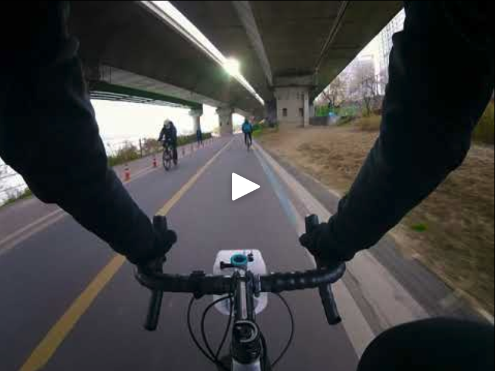
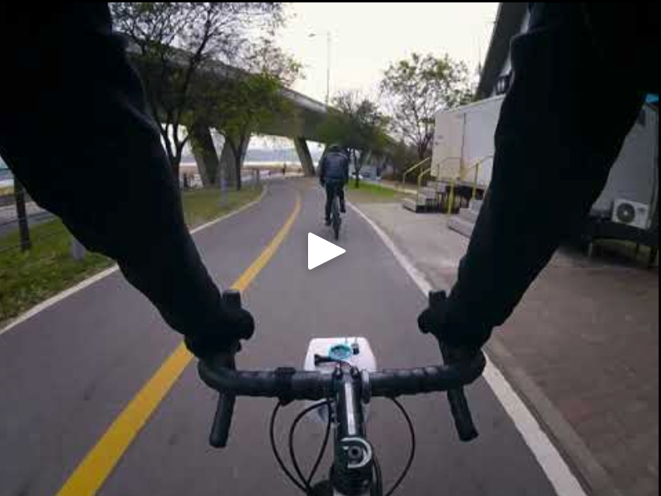
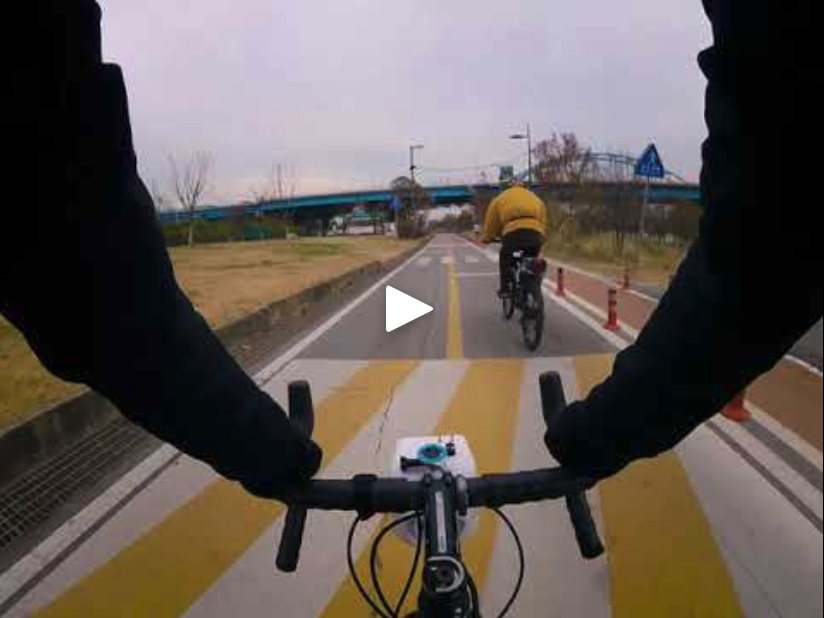
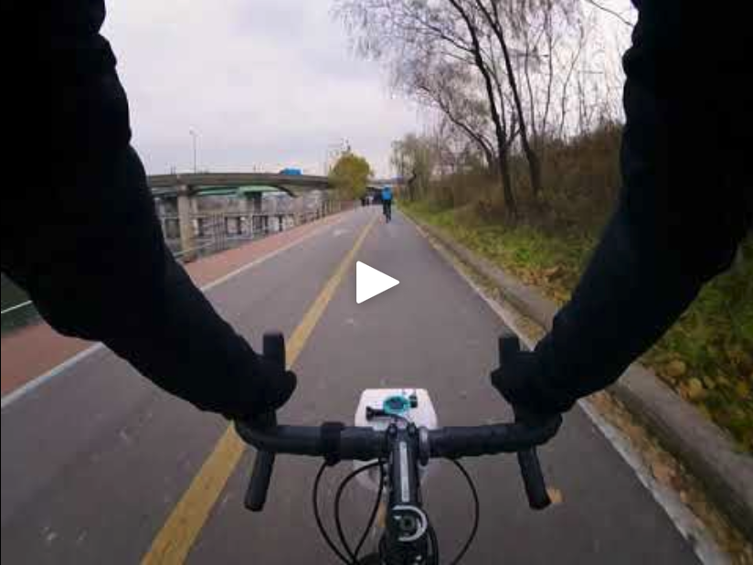

---

<!-- Run ./update-readme-toc.sh -->
<!-- or: doctoc --title '# Table of Contents' --maxlevel 1 README.md -->
<!-- START doctoc generated TOC please keep comment here to allow auto update -->
<!-- DON'T EDIT THIS SECTION, INSTEAD RE-RUN doctoc TO UPDATE -->
# Table of Contents

- [Development Todo List](#development-todo-list)
- [Running on a bike](#running-on-a-bike)
- [Running on a PC](#running-on-a-pc)
- [Repository Structure](#repository-structure)
- [Licensing](#licensing)

<!-- END doctoc generated TOC please keep comment here to allow auto update -->

---

What is velovision?
-------------------

velovision is the world's first computer vision-based active cycling assistance system. Currently, velovision performs Automatic Overtake Warning for  pedestrians, cyclists, and vehicles. See more about [its capabilities](https://hydo.ai) and [limitations](https://hydo.ai).

I was inspired by [commaai/openpilot](https://github.com/commaai/openpilot).

<table>
  <tr>
    <td><a href="https://youtu.be/ND56-PTQYCA" title="chestcam-1"></a></td>
    <td><a href="https://youtu.be/GUyWp-IDISc" title="chestcam-2"></a></td>
    <td><a href="https://youtu.be/BhYqEL78wPo" title="chestcam-3"></a></td>
    <td><a href="https://youtu.be/MSXN9TsbpYU" title="chestcam-4"></a></td>
  </tr>
</table>

# Development Todo List


- [ ] Run on Jetson to validate camera input
- [ ] Cover timing tightly on inference loop, optimize (for example, don't needlessly render visualizations)
- [ ] Write unit tests for subvision parts
- [ ] Create jetson-in-the-loop custom test infrastructure

# Running on a bike

[HYDO Devkit-One](https://hydo.ai) ships with velovision pre-installed and ready to ride.

<details>
  <summary> How to set up Devkit-One from scratch
  </summary>
  
See [hydoai/dk1-setup](https://github.com/hydoai/dk1-setup) for ground-up setup of Devkit-One.


</details>

# Running on a PC

**Clone this repository**

```bash
git clone git@github.com:hydoai/velovision.git
```

**Create conda environment** ([How to install conda](https://docs.conda.io/projects/conda/en/latest/user-guide/install/index.html))

```bash
conda env remove hydo-dev # in case there is a previous environment named hydo-dev
conda env create -f environment.yaml
conda activate hydo-dev
```

**Install YOLOX**

```bash
pip3 install cython; pip3 install 'git+https://github.com/cocodataset/cocoapi.git#subdirectory=PythonAPI'

cd gi-edge/temp

git clone git@github.com:Megvii-BaseDetection/YOLOX.git
cd YOLOX
pip3 install -U pip && pip3 install -r requirements.txt
pip3 install -v -e .  # or  python3 setup.py develop
```

**Download example test videos**

Two sets of videos are used as examples. `Right click -> Save Link As...` to download.
1. GoPro (1920x1080, 30fps)
2. Devkit-One Cameras (front: 1280x720 30fps, rear: 640x480 30fps)

+ [GoPro front](https://storage.hydo.ai/gi-edge-assets/example-footage/long-overtaking.mp4)
+ [GoPro rear](https://storage.hydo.ai/gi-edge-assets/example-footage/long-being-overtaken.mp4)
+ [DevKit-One front](https://storage.hydo.ai/gi-edge-assets/first-blackbox-recordings/front-2021-12-04.mkv)
+ [DevKit-One rear](https://storage.hydo.ai/gi-edge-assets/first-blackbox-recordings/rear-2021-12-04.mkv)

<details>
  <summary> Alternatively, download via `wget`
  </summary>

```bash
wget -O ~/Downloads https://storage.hydo.ai/gi-edge-assets/example-footage/long-overtaking.mp4
wget -O ~/Downloads https://storage.hydo.ai/gi-edge-assets/example-footage/long-being-overtaken.mp4

wget -O ~/Downloads https://storage.hydo.ai/gi-edge-assets/first-blackbox-recordings/front-2021-12-04.mkv
wget -O ~/Downloads https://storage.hydo.ai/gi-edge-assets/first-blackbox-recordings/rear-2021-12-04.mkv
```
  
</details>

**Run main script**

```
cd velovision/computer_vision
python3 vision.py -vid0 ~/Downloads/long-overtaking -vid1 ~/Downloads/long-being-overtaken.mp4 -f yolox_exps/nano-foxtrot.py --view_result
```

## Tips on working with this code

+ The main script is `computer_vision/vision.py`. All submodules are called from there.
+ In many cases, modules are self-testable. So if you want to understand what a module like `from subvision.intercept import intercept` does in isolation, just run that module from your terminal like `python3 intercept.py` and read the code following `if __name__ == "__main__":`. This should give you a good idea of what it does, and also be a 'playground' for you to make temporary experiments.
+ Installing on desktop simply install YOLOX, then installing `hydo-dev` conda environment. However, installing on NVIDIA Jetson platform is more involved and takes much longer. Many usually pip installable packages must be installed from apt and requires other dependencies.

## Run automated tests

Ensure that you are in the `computer_vision` directory, and that you have `hydo-dev` conda environment activated. Then run:

```
python3 -m pytest
```
You might hear some sounds (front and rear warning sounds) while the test is running.

The tests are run via Github Actions on every push to main branch. See test badge at the top for status.

To run these tests on your local system,

[Install nektos/act](https://github.com/nektos/act), then run

```
cd computer_vision
act
```

# Development Tips

## Repository Structure

```
┌─────────────────────────────────────────────────────┐
│ Live Inference Code                                 │
│ ┌─────────────────┐   ┌──────────────────────────┐  │
│ │Sensing Interface│   │ User Interface (UI) Input│  │
│ └───────────────┬─┘   └───┬──────────────────────┘  │
│                 │         │                         │
│               ┌─▼─────────▼───┐                     │
│               │Computer Vision│                     │
│               └─┬─────────┬───┘                     │
│                 │         │                         │
│ ┌───────────────▼──┐   ┌──▼───────────────────────┐ │
│ │Feedback Interface│   │User Interface (UI) Output│ │
│ └──────────────────┘   └──────────────────────────┘ │
│                                                     │
└─────────────────────────────────────────────────────┘
```
*diagram using [asciiflow](https://asciiflow.com)*

+ [Sensing Interface](sensing_interface): Set up camera inputs. Hardware accelerated encoding full FOV front and rear cameras.
+ [UI Input](ui_input): Interface with buttons and switches on the case.
+ [Computer Vision](computer_vision): Object detection neural network, tracking, and warning algorithms. 
+ [Feedback Interface](feedback_interface): Interface with warning sound speaker.
+ [UI Output](ui_output): Interface with OLED display

# Licensing

velovision is released under the Apache-2.0 open source license. Some parts of the software are released under other licenses as specified.

Any user of this software shall indemnify and hold harmless HYDO, Inc. and its directors, officers, employees, agents, stockholders, affiliates, subcontractors and customers from and against all allegations, claims, actions, suits, demands, damages, liabilities, obligations, losses, settlements, judgments, costs and expenses (including without limitation attorneys’ fees and costs) which arise out of, relate to or result from any use of this software by user.

**THIS IS ALPHA QUALITY SOFTWARE FOR RESEARCH PURPOSES ONLY.
NO WARRANTY EXPRESSED OR IMPLIED.**

---
