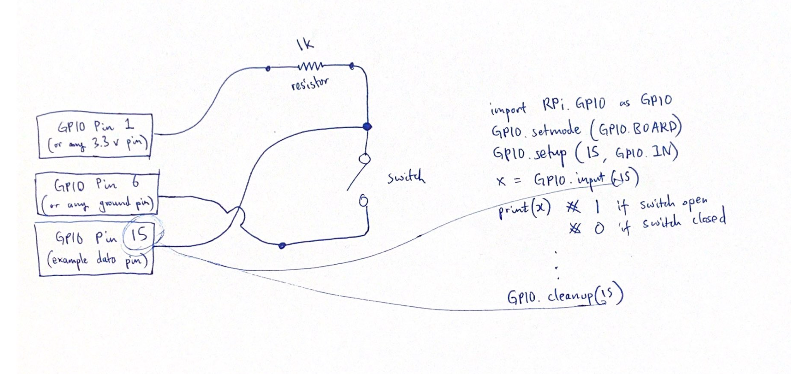

# Control Interface: Registering user input

## GPIO-based digital toggle/push button switch read

Simple one button switch electrical diagram and sample code:

## Safe Shutdown Button [safe_shutdown.py](safe_shutdown.py)
+ Runs in background
+ Polls button 
+ If button is pressed
  + Find and send SIGINT to gstreamer pipelines
  + Which gracefully ends recording streams (sends EOS)
  + Initiate system shutdown
